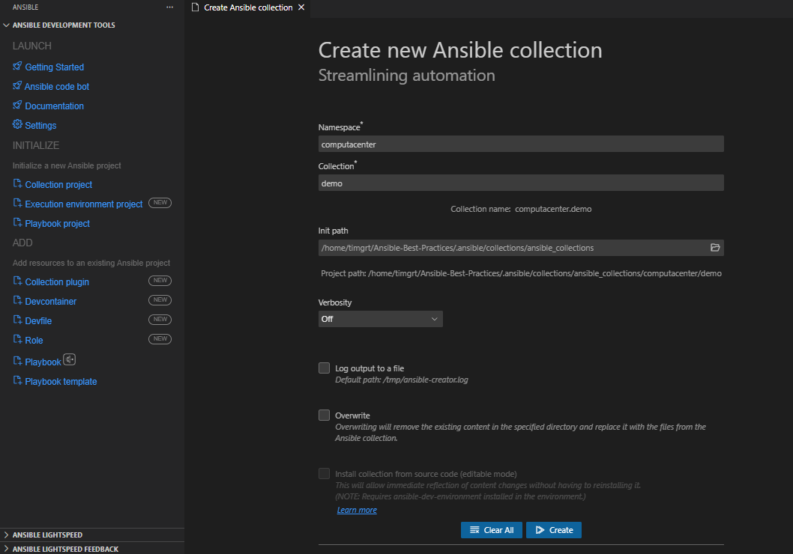

# Collections

Collections are *a distribution format* for Ansible content. You do know collections from installing additional modules and plugins already, but you can also package and distribute your playbooks, roles, modules, and plugins in a custom collection.  

Collection names consist of a **namespace and a name**, separated by a period (`.`). Both namespace and name should consist of ASCII letters (prefer lower-case letters), digits, and underscores (hyphens are not allowed). You should **not** use the following namespaces: `ansible`, `community`, `local`.

!!! question "Collection or Role?"
    If you are writing modules/plugins and/or content which should (or can) be used *outside* of your current project, create a **collection**!  
    For example, your project automates the installation and configuration of a database, but you also created role(s) to harden the underlying Linux host. All hardeing roles should be moved into a collection.  
    **In most cases, collections make more sense as they are the more flexible distribution format.**  

A collection *can* contain one or more roles in the `roles/` directory and these are almost identical to standalone roles, except you need to move plugins out of the individual roles, and use the FQCN in some places.

## Creating collections

A custom collection does not need much, only a `README.md`, a `galaxy.yml` and a `meta/runtime.yml` with the following content:

<div class="grid" markdown>

``` { .yaml .no-copy title="galaxy.yml" }
namespace: "namespace_name"
name: "collection_name"
version: "1.3.1"
readme: "README.md
```

``` { .yaml .no-copy title="runtime.yml" }
requires_ansible: ">=2.15"
```

</div>

You can **(and should!)** provide additional information in the collection configuration files.  
Take a look at the documentation for a complete example and [all valid keys for the `galaxy.yml`](https://docs.ansible.com/projects/ansible/latest/dev_guide/collections_galaxy_meta.html#collections-galaxy-meta){ target=_blank } or the [top-level keys for the `runtime.yml`](https://docs.ansible.com/projects/ansible/latest/dev_guide/developing_collections_structure.html#runtime-yml){ target=_blank }.

To scaffold the collection skeleton, either use  the `ansible-galaxy` (simple and slightly outdated format) or the `ansible-creator` (full-fleged, but may be confusing for beginners) CLI utility.

### Init with ansible-galaxy

To create a new collection use the following command with your desired namespace and (collection) name:

``` { .no-copy }
ansible-galaxy collection init computacenter.demo
```

??? example "Expand to view the created collection skeleton"

    ``` { .no-copy }
    $ tree computacenter/demo/
    computacenter/demo/
    ├── README.md
    ├── docs
    ├── galaxy.yml
    ├── meta
    │   └── runtime.yml
    ├── plugins
    │   └── README.md
    └── roles

    5 directories, 4 files
    ```

To create/initialize the collection alongside your existing project, append `--init-path collections/ansible_collections` to the command above.

The `ansible-galaxy` utility is also used to *build*, *publish* or (how you most likely know it for) *install* collections or collection artifacts.

### Init with ansible-creator

!!! tip
    The `ansible-creator` utility is not included in the default `ansible-core` package and must be [installed separately](https://docs.ansible.com/projects/creator/installing/){ target=_blank }!  
     The *creator* utility seamlessly integrates with **Visual Studio Code (VS Code) and the Ansible extension** for it, offering an intuitive GUI experience.

To create a new collection use the following command with your desired namespace and (collection) name:

``` { .no-copy }
ansible-creator init collection computacenter.demo
```

!!! warning
    The *init* path is different from the `ansible-galaxy` utility!  
    By default, no folder for *namespace* and *collection name* are created, but the collection content skeleton is created in the current folder!

??? example "Expand to view the created collection skeleton"

    ``` { .no-copy }
    $ tree
    .
    ├── CHANGELOG.rst
    ├── CODE_OF_CONDUCT.md
    ├── CONTRIBUTING
    ├── LICENSE
    ├── MAINTAINERS
    ├── README.md
    ├── changelogs
    │   └── config.yaml
    ├── devfile.yaml
    ├── docs
    │   └── docsite
    │       └── links.yml
    ├── extensions
    │   ├── eda
    │   │   └── rulebooks
    │   │       └── rulebook.yml
    │   └── molecule
    │       ├── integration_hello_world
    │       │   └── molecule.yml
    │       └── utils
    │           ├── playbooks
    │           │   ├── converge.yml
    │           │   └── noop.yml
    │           └── vars
    │               └── vars.yml
    ├── galaxy.yml
    ├── meta
    │   └── runtime.yml
    ├── plugins
    │   ├── action
    │   │   ├── __init__.py
    │   │   └── sample_action.py
    │   ├── cache
    │   │   └── __init__.py
    │   ├── filter
    │   │   ├── __init__.py
    │   │   └── sample_filter.py
    │   ├── inventory
    │   │   └── __init__.py
    │   ├── lookup
    │   │   ├── __init__.py
    │   │   └── sample_lookup.py
    │   ├── module_utils
    │   │   └── __init__.py
    │   ├── modules
    │   │   ├── __init__.py
    │   │   ├── sample_action.py
    │   │   └── sample_module.py
    │   ├── plugin_utils
    │   │   └── __init__.py
    │   ├── sub_plugins
    │   │   └── __init__.py
    │   └── test
    │       ├── __init__.py
    │       └── sample_test.py
    ├── pyproject.toml
    ├── requirements.txt
    ├── roles
    │   └── run
    │       ├── README.md
    │       ├── defaults
    │       │   └── main.yml
    │       ├── files
    │       ├── handlers
    │       │   └── main.yml
    │       ├── meta
    │       │   ├── argument_specs.yml
    │       │   └── main.yml
    │       ├── tasks
    │       │   └── main.yml
    │       ├── templates
    │       ├── tests
    │       │   └── inventory
    │       └── vars
    │           └── main.yml
    ├── test-requirements.txt
    ├── tests
    │   ├── integration
    │   │   ├── __init__.py
    │   │   ├── targets
    │   │   │   └── hello_world
    │   │   │       └── tasks
    │   │   │           └── main.yml
    │   │   └── test_integration.py
    │   └── unit
    │       ├── __init__.py
    │       └── test_basic.py
    └── tox-ansible.ini

    40 directories, 49 files
    ```

To initialize the collection with the [VScode Ansible extension](https://marketplace.visualstudio.com/items?itemName=redhat.ansible){ target=_blank }, select the extension, click **Collection project**, enter *namespace* and *collection name*, specify the destination directory and click **Create**.

<figure markdown="span">
  
  <figcaption></figcaption>
</figure>
